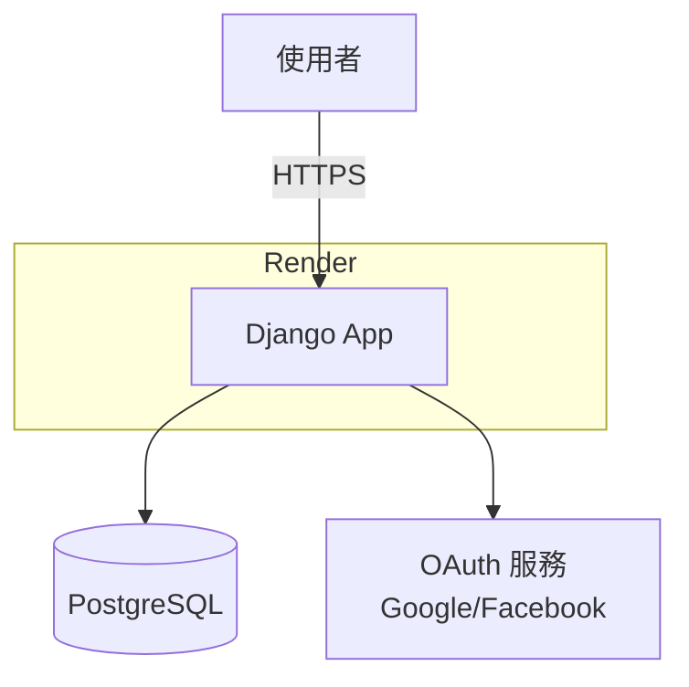

# Django 縮網址服務開發規格

## 專案概述

建立一個支援 Google 和 Facebook 第三方登入的縮網址服務，使用者登入後可以建立短網址、查看點擊統計和來源資訊。

### 設計原則
- MVP（Minimum Viable Product）為目標
- 介面簡潔，不過度設計
- 符合概念 Thin Models, Thin Views, Fat Services
- 遵守 PEP8、Clean Code 原則
- 使用 Black 進行程式碼格式化

---

## 系統假設

### 技術環境假設
- Python 版本：3.13+
- PostgreSQL 已安裝並可正常運作
- 開發環境為 macOS 或 Linux（Windows 需額外設定）
- 具備基本的 Git 和命令列操作能力

### 業務假設
- 初期流量適中（每日 < 1000 次短網址建立）
- 單一使用者不會短時間內大量建立短網址
- 使用者已擁有 Google 或 Facebook 帳號
- 短網址永久有效（無自動過期機制）

### 資料假設
- 點擊記錄永久保留（無定期清理機制）
- IP 完整記錄於資料庫，但前端頁面顯示時進行匿名化處理
- IP 記錄不進行地理位置解析
- User-Agent 解析由 django-user-agents 處理
- 不同使用者縮同一網址會產生不同短碼（資料隔離）

### 安全假設
- 生產環境使用 HTTPS（Render 自動提供）
- Django SECRET_KEY 透過環境變數管理，不提交至版本控制
- OAuth Client ID/Secret 透過環境變數或 Django Admin 管理
- 密碼欄位使用 Django 預設加密機制

### 部署假設
- 使用 Render 作為部署平台
- Render 提供的 PostgreSQL 服務可滿足需求
- 靜態檔案由 Render 自動處理

---

## 不做清單（Out of Scope）

以下功能在 MVP 階段**明確不實作**，避免範圍擴張：

### 使用者相關
- ❌ Email/密碼註冊（僅支援第三方登入）
- ❌ 密碼找回功能
- ❌ 使用者個人資料編輯

### 短網址功能
- ❌ 自訂短碼（使用者指定短網址名稱）
- ❌ 短網址編輯（原網址修改）
- ❌ 批次建立短網址（CSV 上傳）
- ❌ 短網址分類或標籤
- ❌ 短網址過期時間設定
- ❌ QR Code 生成

### 統計與分析
- ❌ 時間範圍篩選（僅顯示全部記錄）
- ❌ 地理位置分析（IP to Location）
- ❌ 圖表視覺化（趨勢圖、圓餅圖等）
- ❌ 匯出統計報表（CSV/Excel）
- ❌ 即時統計儀表板

### 社群與分享
- ❌ 社群媒體分享按鈕
- ❌ 短網址公開/私密設定
- ❌ 短網址留言或評論

### 系統功能
- ❌ 多語系支援（僅繁體中文）
- ❌ RESTful API 端點
- ❌ 手機 App
- ❌ Email 通知（建立成功、點擊提醒等）
- ❌ 速率限制（Rate Limiting）
- ❌ 進階管理後台（使用 Django Admin 即可）

### 效能優化
- ❌ Redis 快取
- ❌ 非同步任務處理（Celery）
- ❌ CDN 整合
- ❌ 資料庫讀寫分離

---

## 系統架構



**架構說明：**
- **使用者**：透過瀏覽器訪問服務
- **Django App**：部署在 Render，處理所有業務邏輯
- **PostgreSQL**：儲存使用者、短網址、點擊記錄
- **OAuth 服務**：處理 Google/Facebook 第三方登入

---

## 技術棧

### 後端框架
- **Django** (含 Django Template)
- **django-allauth** - 第三方登入整合
- **django-user-agents** - User Agent 解析（瀏覽器/裝置/作業系統）

### 資料庫
- **PostgreSQL** - 開發和生產環境皆使用

### 其他工具
- **Sqids** - ID 編碼工具（將數字 ID 轉換為短字串）
- **uv** - Python 套件管理
- **pyproject.toml** - 統一工具設定檔（Black、isort 等）

### 部署平台
- **Render** - 生產環境部署

---

## 程式分層架構 

為符合 Thin Models, Thin Views 原則，確保業務邏輯能與傳輸層（HTML/API）徹底解耦，使用 Service Layer 作為核心邏輯層。

### 1. 設計原則
- 邏輯封裝：所有涉及資料庫多表操作、外部套件調用（如 Sqids 編碼、User-Agent 解析）的業務邏輯必須封裝於 services.py。
- View 為協調者：View 僅負責處理 Request 解析（如 request.POST）、權限檢查與 Response 回傳，不執行任何計算邏輯。
- Model 為資料定義：Model 僅定義 Schema 與基礎欄位關聯，不包含涉及業務流程的 method（如建立點擊紀錄）。
- Domain Exceptions：Service 層應定義並拋出業務相關異常（如 InvalidShortCodeError），由 View 層捕捉並轉換為對應的 HTTP 狀態碼。

### 2. 主要 Service 功能定義

`URLService` 處理短網址核心邏輯

- 建立短網址 (`create_short_url`)：
  - 驗證長網址格式。
  - 建立 URLModel 紀錄。
  - 呼叫 Sqids 根據 user_id 與 url_id 生成唯一短碼並更新。
- **取得或建立短網址 (`get_or_create_short_url`)**：
  - 檢查使用者是否已為相同 URL 建立過短網址。
  - 若已存在，返回現有短網址與 `created=False` 旗標。
  - 若不存在，呼叫 `create_short_url` 建立新短網址與 `created=True` 旗標。
  - 返回 tuple `(url_obj, created)` 供 View 層區分情境。
- 解析短網址 (`get_url_by_code`)：
  - 執行 Sqids 解碼。
  - 查詢資料庫取得 URLModel 實例。
  - 處理短碼無效或不存在之異常。
- 清單檢索 (`get_user_urls`)：
  - 查詢特定使用者所擁有的 URL 列表。

`AnalyticsService` 處理統計與分析

- 記錄點擊 (`record_click`)：

  - 接收 request.META 並處理 IP 匿名化。
  - 呼叫 django-user-agents 解析瀏覽器、系統與裝置資訊。
  - 建立 ClickLog 紀錄。

- 資料彙整 (`get_url_stats`)：
  - 聚合特定短網址的點擊總數與詳細紀錄清單。

### 3. 實作方式
- Service 使用**靜態方法**（`@staticmethod`）或類別方法，不需要實例化
- 自訂異常統一定義在 `shortener/exceptions.py`，繼承自基礎異常類別
- Sqids 編碼器在 Service 模組初始化時建立全域實例

---

## 功能需求

### 1. 使用者認證
- 支援 Google OAuth 登入
- 支援 Facebook OAuth 登入
- 登入後才能使用縮網址功能

### 2. 縮網址功能
- 使用者提交長網址
- 系統產生唯一短網址
- 短網址格式：`https://your-domain.com/{short_code}`
- 不同使用者縮同一網址會產生不同短碼（資料隔離、隱私優先）
- **重複檢測**：同一使用者重複提交相同長網址時，返回已存在的短網址並顯示警告訊息，不建立新記錄

### 3. 重定向功能
- 訪問短網址時，302 重定向至原網址
- 使用 302（暫時重定向）而非 301，確保每次點擊都會經過伺服器以記錄統計

### 4. 統計功能
- 點擊次數統計
- 記錄每次點擊的詳細資訊：
  - 時間戳記
  - 來源 IP（可考慮匿名化）
  - 瀏覽器類型
  - 作業系統
  - 裝置類型
  - Referer（來源網站）

### 5. 介面頁面
- **首頁/登入頁** - Landing page 與登入按鈕
- **我的網址頁** - 列出所有自己建立的短網址，提供新增功能
- **統計詳情頁** - 顯示單一短網址的點擊統計與詳細資訊

---

## 資料模型設計

### User（Django 內建）
Django 預設的 `auth_user` 表，包含：
- `email`
- `username`
- `password`

### SocialAccount（django-allauth 內建）
由 django-allauth 自動管理：
- `socialaccount_socialaccount` - 第三方帳號資訊（Google/FB UID、頭像等）
- `socialaccount_socialapp` - OAuth 應用程式設定（Client ID/Secret）
- `account_emailaddress` - Email 驗證狀態

### URLModel（自定義）
```python
class URLModel(models.Model):
    id = models.AutoField(primary_key=True)
    short_code = models.CharField(max_length=20, unique=True, db_index=True)
    original_url = models.URLField(max_length=2048)
    created_at = models.DateTimeField(auto_now_add=True)
    user = models.ForeignKey(User, on_delete=models.CASCADE)
```

**欄位說明**：
- `short_code` - 使用 Sqids 從 `user.id` 和 `url.id` 編碼生成
- `db_index=True` - 在 `short_code` 建立索引以加速查詢

**資料完整性約束**（選用，建議）：
- 複合唯一性約束 `(user, original_url)` - 防止同一使用者重複建立相同 URL 的短網址
- 自動建立複合索引，提升重複檢測查詢效能
- 防止併發請求產生重複記錄

**未來可擴展欄位**（目前不實作）：
- `title` - 網頁標題（自動抓取或使用者自訂）
- `is_active` - 停用功能

### ClickLog（自定義）
```python
class ClickLog(models.Model):
    url = models.ForeignKey(URLModel, on_delete=models.CASCADE)
    clicked_at = models.DateTimeField(auto_now_add=True)
    ip_address = models.GenericIPAddressField()
    browser = models.CharField(max_length=50, blank=True)
    os = models.CharField(max_length=50, blank=True)
    device_type = models.CharField(max_length=50, blank=True)
    referer = models.URLField(max_length=2048, blank=True)
```

**欄位說明**：
- `ip_address` - 儲存完整 IP 位址，前端顯示時進行匿名化
- `browser/os/device_type` - 由 `django-user-agents` 從 User-Agent 解析
- `referer` - 從 HTTP Header 取得

---

## 核心技術實作

### 1. 短網址編碼策略

**使用 Sqids**

- **原理**：將數字 ID 編碼為字母+數字的字串（類似十進制轉十六進制）
- **可逆性**：可從短碼解碼回原始 ID，無需額外資料庫查詢
- **唯一性保證**：基於 user_id + url_id 編碼，確保不同使用者產生不同短碼

**實作方式**：
- 設定 Sqids 編碼器（建議最小長度 6）
- 編碼時組合 `user.id` 和 `url.id`
- 解碼時取得原始的 `[user_id, url_id]`

**安全考量**：
- Sqids 短碼可被解碼，需在統計頁面嚴格驗證擁有者權限
- 使用 `alphabet` 和 `blocklist` 參數增加混淆

### 2. 第三方登入流程

使用 `django-allauth` 實作 OAuth 流程：

1. **申請 OAuth 憑證**：在 Google/Facebook 開發者平台取得 Client ID、Client Secret
2. **設定 Redirect URL**：配置回調網址（如 `https://your-domain.com/accounts/google/login/callback/`）
3. **使用者授權**：點擊「Google/Facebook 登入」→ 跳轉至第三方授權頁面
4. **取得授權碼**：使用者同意後，第三方回傳臨時授權碼（Code）
5. **交換 Token**：後端使用 Code 向第三方伺服器換取 Access Token
6. **建立/登入帳號**：根據取得的 Email，在資料庫建立或登入使用者

### 3. 點擊統計實作

**策略：透過 Service 層進行同步記錄**

每次短網址被訪問時，在重定向前新增一筆 `ClickLog` 記錄。由 View 協調 URLService 與 AnalyticsService 完成流程，確保核心邏輯封裝於 Service 中。

**實作流程**：
1. View 層：接收請求短碼，呼叫 Service 取得資料並記錄統計，最後執行 302 重定向。
2. `URLService.get_url_by_code(code)`：
   - 解碼短碼取得 `user_id` 和 `url_id`
   - 查詢對應的 URLModel，若不存在則拋出 NotFound 異常
3. `AnalyticsService.record_click(url, request)`：
   - 從 Request 取得完整 IP 位址（處理 `X-Forwarded-For` 標頭）
   - 使用 django-user-agents 解析 User-Agent Header，提取瀏覽器、作業系統、裝置類型
   - 記錄 Referer
   - 建立並儲存 ClickLog 記錄（IP 以完整形式儲存）
4. View 層：執行 302 重定向至原網址

### 4. IP 位址處理

**取得真實 IP**：
- 優先從 `HTTP_X_FORWARDED_FOR` Header 取得（處理 Proxy/CDN 情境）
- 若不存在則使用 `REMOTE_ADDR`
- 處理多層 Proxy 情境時，取第一個 IP（最接近客戶端）

**儲存與顯示策略**：
- **資料庫**：儲存完整 IP 位址（保留完整資料供必要時查詢）
- **前端顯示**：匿名化處理後顯示
  - **IPv4**：遮蔽最後一段（例：192.168.1.100 → 192.168.1.0）
  - **IPv6**：遮蔽後 80 位元
- **目的**：平衡資料完整性與使用者隱私保護

---

## URL 端點設計

| 端點 | HTTP 方法 | 功能說明 | 權限要求 |
|------|-----------|----------|----------|
| `/` | GET | 首頁/登入頁 | 公開 |
| `/accounts/*` | GET/POST | OAuth 登入流程 | 公開 |
| `/my-urls/` | GET | 我的網址列表頁 | 需登入 |
| `/my-urls/` | POST | 建立短網址 | 需登入 |
| `/stats/<code>/` | GET | 統計詳情頁 | 需登入（僅限擁有者） |
| `/<code>/` | GET | 短網址重定向 | 公開 |

**注意事項：**
- `/my-urls/` 同時處理 GET（顯示列表）和 POST（建立短網址）請求
- 短網址重定向路由（`/<code>/`）必須放在路由配置的最後，避免攔截其他路由
- OAuth 相關路由由 django-allauth 自動處理（`/accounts/*`）
- 所有需登入的頁面使用 `@login_required` 或等效機制保護

---

## 頁面架構

**語言設定：**
- 前端頁面使用英文介面（按鈕、標籤、提示訊息等）
- Django Admin 後台使用繁體中文（`verbose_name` 等設定為中文）

### 1. 首頁/登入頁 (`home.html`)
- 顯示專案說明
- Google 登入按鈕
- Facebook 登入按鈕

### 2. 我的網址頁 (`my_urls.html`)
- Header：使用者資訊、登出按鈕
- 表單：輸入長網址、提交按鈕
- 列表：只顯示當前使用者建立的 URL，按建立時間倒序排列
  - 短網址連結（可複製）
  - 原始網址
  - 建立時間
  - 點擊次數
  - 查看統計按鈕

**View 行為：**
- **功能**：顯示當前使用者建立的所有短網址與新增表單
- **權限**：需登入（Login Required）
- **查詢邏輯**：
  - 呼叫 `URLService.get_user_urls_with_stats(request.user)` 取得該使用者的 URL 列表（含點擊統計）
  - 若為 POST 請求，呼叫 `URLService.get_or_create_short_url(request.user, original_url)` 建立或取得短網址
- **訊息回饋**：
  - 新建立短網址：綠色成功訊息（`messages.success`）
  - 重複 URL：黃色警告訊息（`messages.warning`），提示已存在並顯示該短網址
  - 驗證失敗：紅色錯誤訊息（`messages.error`）
- **錯誤處理**：未登入時重定向至登入頁，驗證失敗時由 Service 拋出異常，View 負責將錯誤訊息傳回模板顯示

### 3. 統計詳情頁 (`url_stats.html`)
- Header：返回、登出按鈕
- 短網址資訊：短碼、原網址、建立時間
- 統計摘要：總點擊次數
- 點擊記錄表格：
  - 時間
  - IP 位址
  - 瀏覽器
  - 作業系統
  - 裝置類型
  - 來源網站

**View 行為：**
- **功能**：顯示單一短網址的詳細統計資料
- **權限**：需登入且僅限擁有者訪問
- **查詢邏輯**：
  - 呼叫 `URLService.get_url_by_code(code)` 取得 URL 物件
  - 驗證當前使用者 `request.user` 是否為擁有者 `url.user`
  - 呼叫 `AnalyticsService.get_url_stats(url_obj)` 取得彙整後的統計數據與點擊紀錄
- **錯誤處理**：
  - 捕捉到 `URLService` 的 NotFound 異常時回傳 404 Not Found
  - 非擁有者訪問：403 Forbidden 或 404 Not Found

---

## 錯誤處理

Service 層負責定義業務邏輯錯誤（Domain Exceptions），View 層則負責將這些異常轉換為對應的 HTTP 狀態碼或頁面提示。

### 1. 異常處理規範
- **異常定義**：自訂異常統一定義在 `shortener/exceptions.py`，如 `UrlNotFoundError`、`AccessDeniedError` 等，皆繼承自基礎異常類別。表單驗證使用 Django 內建的 `ValidationError`。
- **Service 層**：當偵測到無效輸入或違反業務規則時，拋出具名異常（如 `UrlNotFoundError`）。
- **View 層**：使用 `try...except` 捕捉 Service 異常。HTML View 捕捉後重定向至錯誤頁面或顯示 Form 錯誤；API View 則轉換為 4xx 狀態碼。

### 2. 常見錯誤情境處理

#### 短網址不存在或解碼失敗
- **情境**：訪問不存在的短碼、短碼格式錯誤、或 Sqids 無法正常解碼。
- **Service 責任**：`URLService` 在解碼失敗或查詢不到資料時，統一拋出 `UrlNotFoundError`。
- **View 處理**：捕捉異常後，回傳 404 Not Found 頁面，顯示訊息：「此短網址不存在或已失效」。

#### 權限不足
- **情境**：未登入使用者嘗試訪問私有頁面，或使用者嘗試查看非其擁有的統計資料。
- **Service 責任**：提供驗證函數，若 `url.user != current_user` 則拋出 `AccessDeniedError`。
- **View 處理**：
  - 未登入：由 `@login_required` 重定向至登入頁。
  - 非擁有者：回傳 403 Forbidden。

#### URL 驗證失敗
- **情境**：使用者提交的原始網址格式不正確。
- **Service 責任**：驗證 `original_url`，不合法時拋出 `ValidationError`。
- **View 處理**：將錯誤訊息綁定至 Django Form，重新渲染頁面並提示使用者。

#### OAuth 登入失敗
- **情境**：第三方授權失敗或使用者取消授權。
- **處理**：由 django-allauth 自動捕捉並處理，View 負責配置預設的錯誤回調頁面。

---

## 開發流程

### 1. 環境設定

**必要工具：**
- Python 3.13 或以上
- PostgreSQL
- uv（Python 套件管理工具）

**初始化步驟：**
1. 使用 uv 初始化專案並安裝依賴套件
   - Django
   - django-allauth
   - django-user-agents
   - sqids
   - psycopg2-binary
2. 設定開發工具（Black、isort）

### 2. Django 專案建立

1. 建立 Django 專案結構
2. 建立應用程式（App）
3. 配置 `pyproject.toml` 作為工具設定檔

### 3. 資料庫設定

**配置要求：**
- 使用 PostgreSQL 資料庫引擎
- 資料庫名稱：`url_shortener_db`（或自訂）
- 連線資訊透過環境變數管理（建議使用 `DATABASE_URL`）
- 開發與生產環境使用相同的資料庫引擎

### 4. pyproject.toml 設定

配置 Black 和 isort 的共用設定：
- Black 行長度：88
- isort 相容 Black profile

### 5. Django-allauth 設定

**必要配置：**
- 在 `INSTALLED_APPS` 中啟用：
  - `django.contrib.sites`
  - allauth 核心模組
  - Google 和 Facebook provider
- 設定 `SITE_ID = 1`
- 配置 `AUTHENTICATION_BACKENDS` 包含 allauth 後端
- 設定登入/登出重定向 URL：
  - 登入後 → `/my-urls/`
  - 登出後 → `/`

**OAuth 應用程式設定：**
- 至 Google Cloud Console 建立 OAuth 2.0 憑證
- 至 Facebook Developers 建立應用程式
- 在 Django Admin 中新增 Social Application，填入 Client ID 和 Secret

### 6. 模型建立與遷移

1. 定義 `URLModel` 和 `ClickLog` 模型
2. 執行資料庫遷移生成資料表

### 7. 開發與測試

啟動開發伺服器進行本地測試

---

## 測試策略

### 測試重點
- **Service 層**：Sqids 編碼/解碼、IP 位址處理、異常拋出情境
- **View 層**：權限驗證（擁有者檢查）、錯誤處理
- **Model 層**：基本 CRUD、欄位驗證

### 執行測試
```bash
python manage.py test              # 全部測試
python manage.py test shortener    # 單一 app
```

---

## 部署指南（Render）

### 環境設定
- 在 Render 建立 PostgreSQL 和 Web Service
- 設定環境變數：`SECRET_KEY`、`DATABASE_URL`、`DEBUG=False`
- 設定 `ALLOWED_HOSTS` 包含部署網域

### 部署指令
- **Build Command**: `pip install && python manage.py collectstatic --noinput && python manage.py migrate`
- **Start Command**: `gunicorn core.wsgi:application`

### OAuth 回調網址
需在 Google/Facebook 開發者平台設定正式網域的回調網址（如 `https://your-app.onrender.com/accounts/google/login/callback/`）

---

## 未來擴展功能

目前 MVP 不實作，但可作為後續改進方向：

### 功能面
- **速率限制**：每小時建立短網址的上限
- **過期機制**：設定短網址有效期限
- **自訂短碼**：允許使用者自訂短網址（需檢查重複）
- **批次建立**：上傳 CSV 批次產生短網址
- **QR Code 生成**：為短網址生成 QR Code
- **時間範圍篩選**：統計頁面可選擇日期區間

### 效能面
- **點擊記錄非同步化**：使用 Celery + Redis 處理高流量
- **快取機制**：使用 Redis 快取熱門短網址
- **資料庫索引優化**：針對常用查詢建立複合索引

### 資料分析
- **地理位置分析**：根據 IP 解析地理位置
- **點擊趨勢圖表**：使用 Chart.js 顯示時間序列圖表
- **來源分析**：統計 Referer 域名分布

---

## 程式碼規範

### 格式化工具
- **Black**：自動格式化 Python 程式碼
- **isort**：自動排序 import 語句

```bash
# 格式化所有程式碼
black .
isort .
```

### 命名規範
- **Models**：使用大駝峰式（PascalCase），如 `URLModel`, `ClickLog`
- **Views/Functions**：使用蛇形命名法（snake_case），如 `shorten_url`, `get_client_ip`
- **變數**：使用蛇形命名法，如 `short_code`, `user_id`

### 註解規範
- 在複雜邏輯前加上簡潔的註解
- 使用 docstring 描述函數功能
```python
def anonymize_ip(ip_str):
    """
    遮蔽 IP 位址的最後一段以保護隱私
    
    Args:
        ip_str: IP 位址字串
        
    Returns:
        匿名化後的 IP 位址
    """
    pass
```